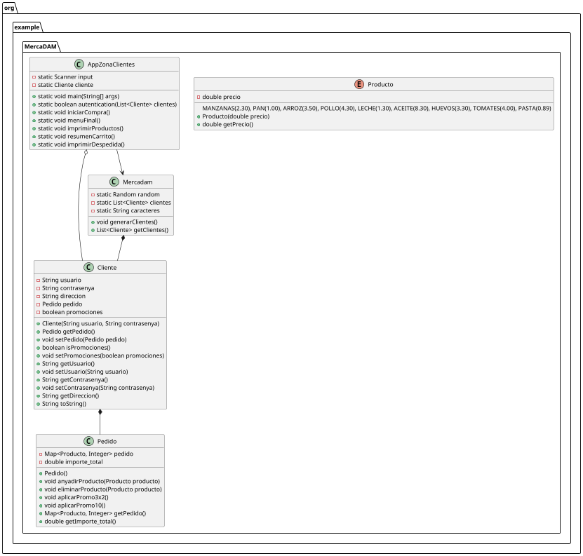

# Markdown

## ÍNDICE

1. [Resumen](#resumen)
2. [Estructura de clases](#estructura-de-clases)
4. [Estructura de clases](#estructura-de-clases)
5. [Programa principal](#programa-principal)
6. [Pruebas](#pruebas)

## Resumen
> Este proyecto consiste en una app de compra online para un supermercado ficticio llamado **MERCADAM**.

## Estructura de clases

El programa se divide en: 

- **Cliente**: Contiene la clase cliente:
  - Atributos:
    - usuario y contrasenya: los recibe constructor, en mi programa se llama desde Mercadam con dos valores aleatorios.
    - direccion: se inicializa con calle falsa, 123 siempre
    - pedido: tipo pedido, se inicializa en null, se asigna después desde el main.
    - promociones: se inicializa en false, el cliente puede usarlas una vez por compra.
  - Métodos:
    - Contiene los getters y setters necesarios, además del toString.
- Mercadam: contiene una lista con los usuarios, y un string con los caracteres válidos.
  - Métodos: 
    - generarClientes: genera tres clientes aleatorios y los introduce en la lista. Genera un usuario y una contraseña aleatoria y luego crea el objeto.
    - getClientes: método para recibir la lista desde el main, me permite hacer la autenticación y llegar hasta el pedido de cliente. 
- Pedido: clase para pedido:
  - Atributos: 
    - pedido: mapa para los productos, <Producto(enum), Integer(cantidad)>
    - importe_total: total del carrito.
  - Métodos: 
    - anyadir y eliminarProducto, añaden o eliminan productos, eliminarProducto es parte del bonus y comprueba que la cantidad sea 0 para eliminarlo.
    - aplicarPromo 10% y 2x3, aplican las promociones al importe total. 
- Producto: enum. Contiene los valores posibles y el precio de cada producto. 

## Diagrama de clases

## Programa principal
Contiene un atributo estático de tipo Cliente para poder acceder a él desde todos los métodos. Si se quiere acceder al pedido se puede hacer mediante cliente.getPedido().getPedido(): el primero recibe el objeto de tipo pedido y el segundo el mapa con los productos.

**AppZonaClientes**: funciona como un main, contiene los métodos:
  - main: parte principal, llama a los demás métodos y controla los intentos del login.
  - autenticacion: recibe una lista, devuelve un booleano true si usuario y contraseña están en ella.
  - iniciarCompra: método dedicado a añadir productos a la cesta es un void y utiliza la variable global clientes. Añade productos mientras no se responda que no. También controla que la entrada del usuario corresponda con un tipo del enum.
  - menuFinal: controla toda la parte del final de la aplicación con un switch.
  - imprimirProductos, resumenCarrito e imprimir despedida son métodos de tipo void que solamente imprimen.

## Pruebas

